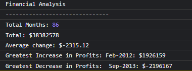

# Financial analysis with JavaScript

## Table of contents

- [Overview](#overview)
  - [The challenge](#the-challenge)
  - [Screenshot](#screenshot)
  - [Links](#links)
- [My process](#my-process)
  - [Built with](#built-with)
  - [What I learned](#what-i-learned)
  - [Continued development](#continued-development)
  - [Useful resources](#useful-resources)
- [Author](#author)


## Overview

### The challenge

To create a financial analysis of the provided dataset.

### Screenshot




## Links

- [Github URL](https://github.com/pandi1813/Console--Finances)
- [Live Site URL](https://pandi1813.github.io/Console--Finances/)

## My process

### Built with

- JavaScript variables
- Array, number and string data types 
- For loops


### What I learned

- How to use for loops to add up elements of an array
- How to push new elements to the end of an array
- How to find the largest and the smallest number in an array
- What index numbers of array elements are and how to retrieve elements with them


```js

 let valueChanges = []; // array to store monthly value changes 

 for (let i = 1; i < totalMonths; i++) {
    let changePerMonth = values[i] - values[i-1];

    valueChanges.push(changePerMonth)
 }
```


### Continued development

Try to simplify what I can and to arrange the code to make it easier to read

### Useful resources

- Nick Morgan: JavaScript for kids - This book explains the basic concepts really well, it helped me a lot to understand what we covered on classes
- [MDN JavaScript articles](https://developer.mozilla.org/en-US/docs/Web/JavaScript) - I used MDN documentations to find how to do certain tasks when I got stuck 


## Author
  Andrea Peter
- GitHub - [pandi1813](https://github.com/pandi1813)
